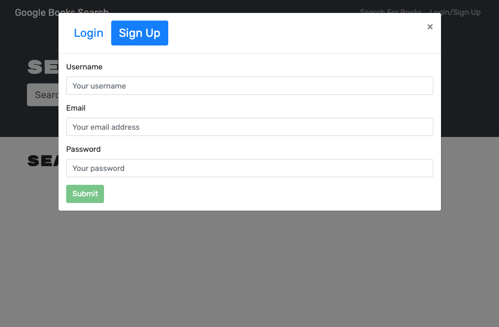

# googlebooks-app

# Book Search Engine

## Table of contents

- [Description](#description)
- [Installation](#installation)
- [Usage](#usage)
- [Technologies and Languages](#technologies-and-languages)
- [Contributing](#contributing)
- [Tests](#tests)
- [License](#license)
- [Screenshots](#screenshots)
- [Deployed application](#deployed-application)
- [GitHub repository](#github-repository)
- [Questions](#questions)

---

## Description

I have been tasked to take starter code with a fully functioning Google Books API search engine built with a RESTful API, and refactor it to be a GraphQL API built with Apollo Server. The app was built using the MERN stack with a React front end, MongoDB database, and Node.js/Express.js server and API.

To complete this successfully I will need to do the following:

1. Set up an Apollo Server to use GraphQL queries and mutations to fetch and modify data, replacing the existing RESTful API.

2. Modify the existing authentication middleware so that it works in the context of a GraphQL API.

3. Create an Apollo Provider so that requests can communicate with an Apollo Server.

4. Deploy your application to Heroku with a MongoDB database using MongoDB Atlas.

## Screenshots





## Installation

To install the required dependencies and set up the application, run:

```
$ npm i
$ npm run develop
```

## Deployed Application Links

https://googlebookssearch-app.heokuapp.com

https://github.com/aali9/googlebooks-app
